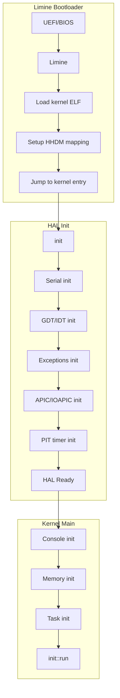
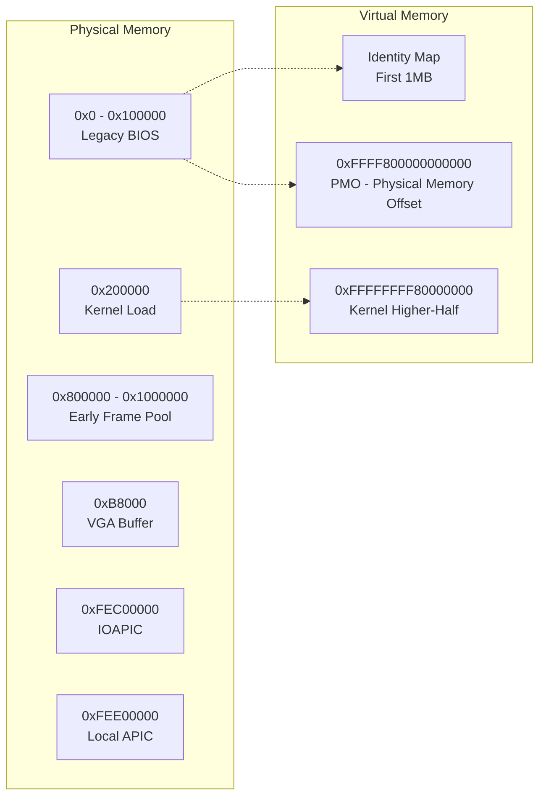
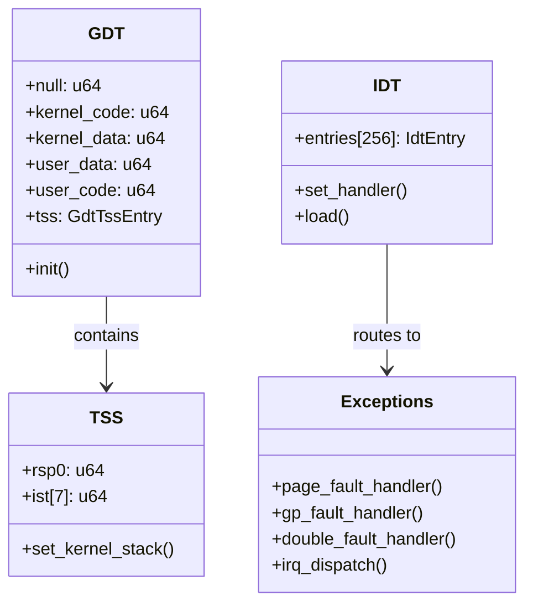
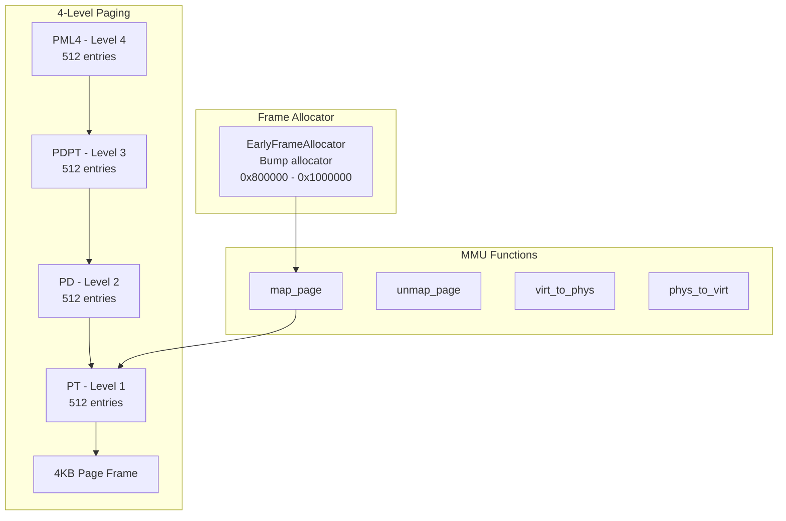
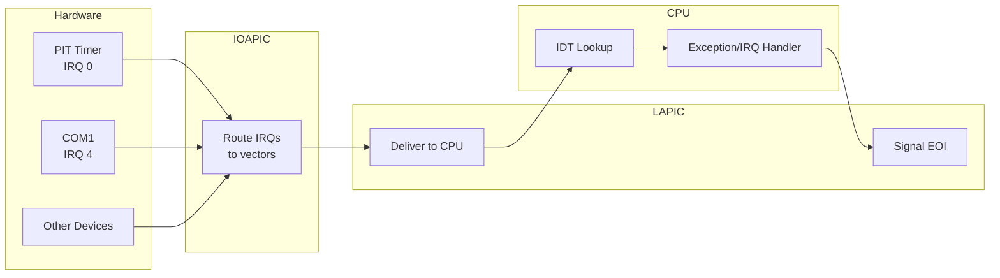
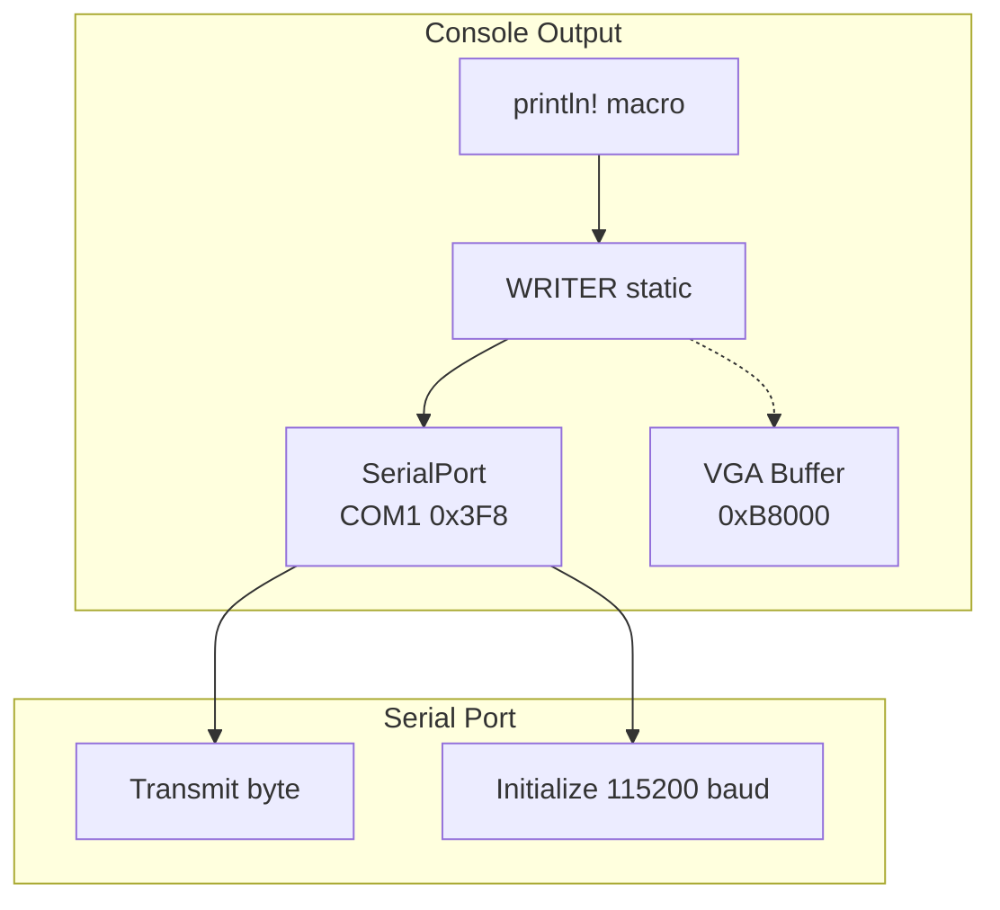

# x86_64 Hardware Abstraction Layer

This directory contains the x86_64-specific HAL implementation, organized into logical compartments.

## Directory Structure

```
x86_64/
├── cpu/           # CPU structures (GDT, TSS, IDT, exceptions)
├── mem/           # Memory management (paging, MMU, frame allocator)
├── interrupts/    # Interrupt handling (APIC, IOAPIC, PIT)
├── io/            # I/O devices (serial, VGA, console)
├── boot/          # Boot info (Limine-only)
└── mod.rs         # Main module with init functions
```

## Boot Flow

The following diagram shows the x86_64 boot sequence from BIOS/bootloader to kernel:



## Memory Layout



## Compartment Details

### cpu/ - CPU Structures



### mem/ - Memory Management



### interrupts/ - Interrupt Handling



### io/ - I/O Devices



## Key Constants

| Constant | Value | Description |
|----------|-------|-------------|
| `KERNEL_VIRT_BASE` | `0xFFFFFFFF80000000` | Kernel higher-half base |
| `PHYS_OFFSET` | `0xFFFF800000000000` | Physical memory offset (PMO) |
| `PAGE_SIZE` | `0x1000` (4KB) | Standard page size |
| `HUGE_PAGE_SIZE` | `0x200000` (2MB) | Huge page size |
| `APIC_BASE` | `0xFEE00000` | Local APIC address |
| `IOAPIC_BASE` | `0xFEC00000` | I/O APIC address |

## Known Issues

### TEAM_317: HHDM Doesn't Map MMIO

**Problem:** Limine's HHDM (Higher Half Direct Map) only maps RAM, not MMIO regions.

```
HHDM maps:     Physical RAM → 0xFFFF800000000000 + phys_addr
HHDM does NOT: APIC (0xFEE00000), IOAPIC (0xFEC00000), PCI MMIO
```

**Symptom:** Page fault at `0xFFFF8000FEE000xx` when accessing APIC via `phys_to_virt()`.

**Current Workaround:** Skip APIC/IOAPIC init, use legacy PIC mode with PIT timer.

**Proper Fix (TODO):** Map MMIO regions explicitly before enabling APIC mode.

## Files

| File | Description |
|------|-------------|
| `cpu/gdt.rs` | Global Descriptor Table and TSS |
| `cpu/idt.rs` | Interrupt Descriptor Table |
| `cpu/exceptions.rs` | Exception handlers and IRQ dispatch |
| `mem/paging.rs` | Page table structures and operations |
| `mem/mmu.rs` | Memory mapping, address translation |
| `mem/frame_alloc.rs` | Early bump allocator for page frames |
| `interrupts/apic.rs` | Local APIC controller |
| `interrupts/ioapic.rs` | I/O APIC for external interrupts |
| `interrupts/pit.rs` | Programmable Interval Timer |
| `interrupts/state.rs` | Interrupt enable/disable/restore |
| `io/serial.rs` | COM1 serial port driver |
| `io/vga.rs` | VGA text mode buffer |
| `io/console.rs` | Console writer abstraction |
| `boot/multiboot2.rs` | Multiboot2 boot info parsing |
