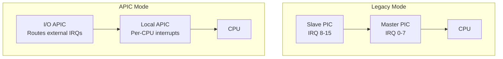
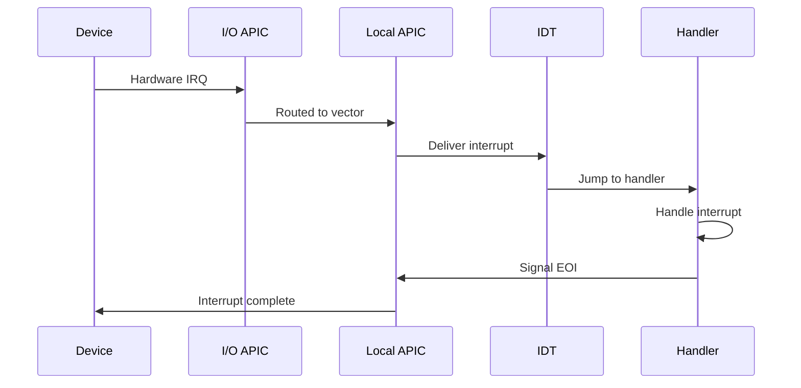
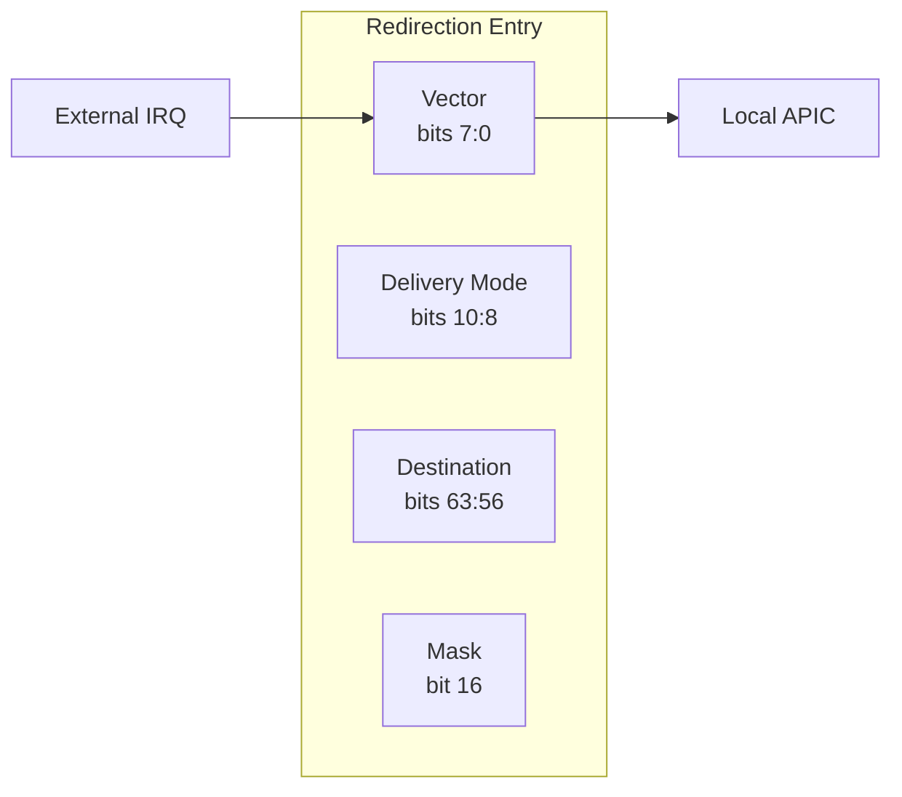
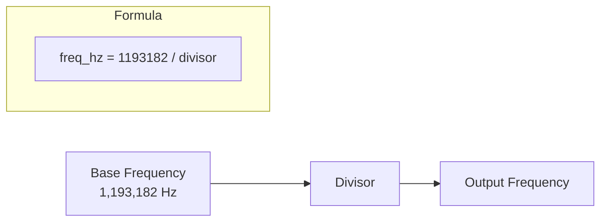
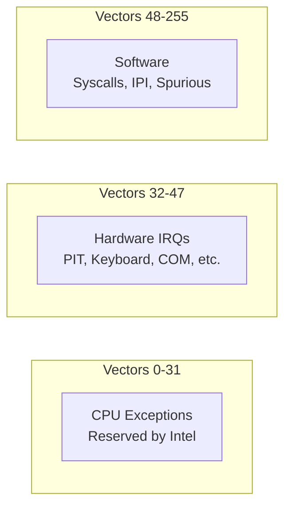

# Interrupts Compartment

This compartment handles interrupt controllers and timers for x86_64.

## Files

| File | Description |
|------|-------------|
| `apic.rs` | Local APIC controller |
| `ioapic.rs` | I/O APIC for external interrupt routing |
| `pit.rs` | Programmable Interval Timer |
| `state.rs` | Interrupt enable/disable/restore |

## Interrupt Architecture

x86_64 has two interrupt controller modes:



**LevitateOS currently uses Legacy PIC mode** due to PMO mapping issues with APIC addresses.

## Interrupt Flow



## Local APIC (`apic.rs`)

The Local APIC handles per-CPU interrupt delivery:

### Memory-Mapped Registers

| Register | Offset | Description |
|----------|--------|-------------|
| ID | `0x20` | APIC ID |
| EOI | `0xB0` | End of Interrupt |
| Spurious | `0xF0` | Spurious Interrupt Vector |

### Base Address

```
APIC Base: 0xFEE00000 (default)
```

**Note**: This address is ~4GB, outside the 1GB PMO range. Currently skipped during init.

### Handler Registration

```rust
// Register a handler for a vector
pub fn register_handler(vector: u8, handler: &'static dyn InterruptHandler)

// Dispatch to registered handler
pub fn dispatch(vector: u8) -> bool
```

### IRQ Mapping

| IrqId | Vector | Description |
|-------|--------|-------------|
| `VirtualTimer` | 32 | PIT timer (IRQ 0) |
| `Uart` | 36 | COM1 serial (IRQ 4) |

## I/O APIC (`ioapic.rs`)

The I/O APIC routes external device interrupts to CPUs:

### Base Address

```
IOAPIC Base: 0xFEC00000 (default)
```

### Redirection Table

Each external IRQ has a 64-bit redirection entry:



## PIT (`pit.rs`)

The Programmable Interval Timer generates periodic interrupts:

### I/O Ports

| Port | Description |
|------|-------------|
| `0x40` | Channel 0 data |
| `0x43` | Command register |

### Configuration



### Initialization

```rust
// Initialize PIT at 100 Hz (10ms intervals)
Pit::init(100);
```

### Command Byte (0x36)

```
Bits 7-6: Channel (00 = Channel 0)
Bits 5-4: Access mode (11 = lobyte/hibyte)
Bits 3-1: Operating mode (011 = rate generator)
Bit 0:    BCD mode (0 = binary)
```

## Interrupt State (`state.rs`)

Functions to control CPU interrupt flag (IF in RFLAGS):

### API

```rust
/// Disable interrupts, return previous state
pub fn disable() -> u64

/// Unconditionally enable interrupts
pub unsafe fn enable()

/// Restore previous interrupt state
pub fn restore(state: u64)

/// Check if interrupts are enabled
pub fn is_enabled() -> bool
```

### RFLAGS IF Bit

```
RFLAGS bit 9 (0x200) = Interrupt Flag
  - 1 = Interrupts enabled
  - 0 = Interrupts disabled
```

### Usage Pattern

```rust
// Critical section
let state = disable();  // Save and disable
// ... critical code ...
restore(state);         // Restore previous state
```

### Mock Implementation

For `std` feature (testing), a mock implementation uses atomics:

```rust
#[cfg(feature = "std")]
static MOCK_FLAGS: AtomicU64 = AtomicU64::new(0x200);
```

## Vector Assignments



| Range | Use |
|-------|-----|
| 0-31 | CPU exceptions |
| 32 | PIT timer (IRQ 0) |
| 33 | Keyboard (IRQ 1) |
| 36 | COM1 (IRQ 4) |
| 255 | Spurious interrupt |

## EOI (End of Interrupt)

After handling an interrupt, EOI must be sent:

### APIC EOI
```rust
APIC.signal_eoi();  // Write 0 to EOI register
```

### PIC EOI (Legacy)
```rust
// Master PIC
out 0x20, 0x20

// Slave PIC (for IRQ 8-15)
out 0xA0, 0x20
out 0x20, 0x20
```

## Known Issues (TEAM_317)

### HHDM Doesn't Map MMIO Regions

Limine's HHDM only maps RAM, not MMIO regions like APIC/IOAPIC:

```
APIC at 0xFEE00000   → phys_to_virt() = 0xFFFF8000FEE00000 → NOT MAPPED
IOAPIC at 0xFEC00000 → phys_to_virt() = 0xFFFF8000FEC00000 → NOT MAPPED
```

**Current Workaround**: 
- Skip APIC/IOAPIC initialization
- Use legacy PIC mode with PIT timer
- Send EOI to PIC (port 0x20) instead of APIC

```rust
// Legacy PIC EOI in irq_dispatch()
asm!("mov al, 0x20", "out 0x20, al");
```

**Proper Fix (TODO)**: Map MMIO regions explicitly before enabling APIC.
