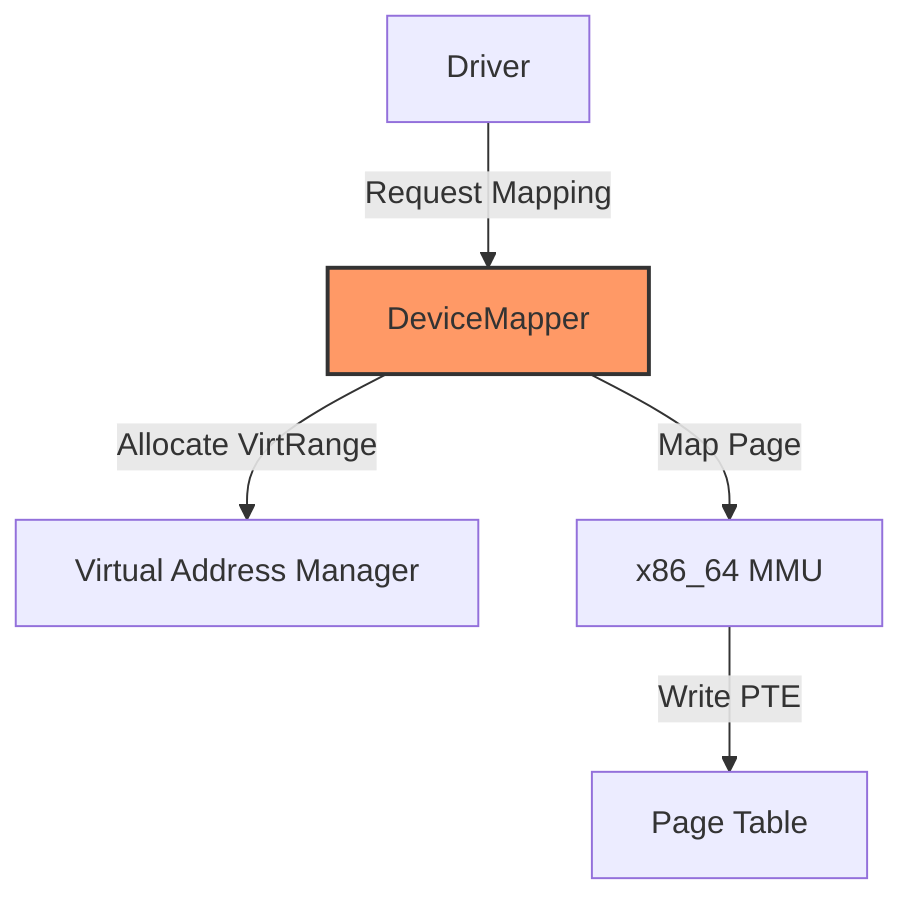
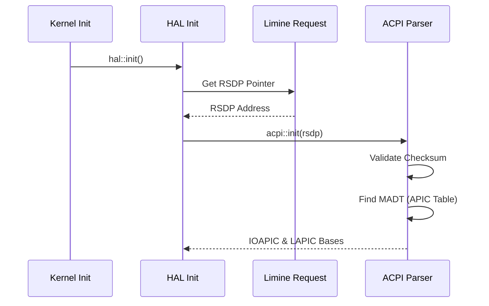

# Phase 2: Design - Bare Metal NUC Support

## Proposed Solution
The goal is to transition LevitateOS from "VirtIO-only" to "Hardware-aware". 

### 1. Unified Framebuffer (UEFI GOP)
Instead of a separate `intel-gpu` driver (which is massive), we will implement a `GenericFramebuffer` trait.
- Limine passes a `limine_framebuffer` response.
- We will create a `SimpleGpu` driver that implements the `gpu` trait using this pre-allocated buffer.
- This allows graphics on any UEFI-compliant hardware immediately.

### 2. Physical Memory & MMIO Mapping
Currently, the `x86_64` HAL relies on `phys_to_virt(pa)` which only works if the address is within the Physical Memory Offset (PMO) range. On bare metal, hardware registers (APIC, IOAPIC, PCI ECAM) are often located at high physical addresses (e.g., `0xFEE00000`) that may not be covered by the initial 1GB PMO.

- **Requirement**: Implement a `map_device_memory(phys, size)` mechanism.
- **Implementation**:
    - Reserve a virtual range in the kernel's higher-half (e.g., `0xFFFFFFFF40000000`).
    - The MMU will map these pages as `DEVICE` (Non-Cacheable, Writable, No-Execute).
    - Drivers must use this virtual pointer instead of `phys_to_virt`.

### 3. ACPI Subsystem [NEW]
Bare metal NUC support is impossible without ACPI. We need it to find the real addresses of the APIC/IOAPIC and to identify CPUs and power states.

- **Component**: `crates/hal/src/x86_64/boot/acpi.rs`.
- **Logic**:
    - Locate the `RSDP` (Root System Description Pointer) via Limine's ACPI request.
    - Parse **MADT** (Multiple APIC Description Table) to enumerate LAPICs and IOAPICs.
    - Parse **FADT** (Fixed ACPI Description Table) for sleep/reboot mechanisms.

### 4. Interrupt Routing Migration (PIC -> APIC/MSI)
Current HAL uses the 8259 PIC as a temporary crutch. This must be replaced for NVMe and modern NUC hardware.

- **LAPIC**: Map and initialize the Local APIC for every CPU.
- **IOAPIC**: Map and route legacy IRQs (ISA) to the APIC.
- **MSI/MSI-X**: Implement an API in `los_pci` to configure Message Signaled Interrupts. This allows devices like NVMe to send interrupts directly to the LAPIC without using IOAPIC pins.

### 3. NVMe Driver Architecture
- New crate `crates/drivers/nvme`.
- **Detailed Design**: See [nvme-detailed-design.md](file:///home/vince/Projects/LevitateOS/docs/planning/bare-metal-nuc/nvme-detailed-design.md).
- **Inspiration**: Emulate Theseus's `mlx5` queue model (Submission/Completion pairs).
- **Interrupts**: Polling first, then MSI-X.

### 4. XHCI/USB Stack
- This is the largest task. We will start with a minimal XHCI driver that only supports HID (Keyboard/Mouse) for the NUC.
- New crate `crates/drivers/xhci`.
- Integrates with `input-device` trait.

## API Design Changes
### PCI Crate
Update `crates/pci` to support custom filters:
```rust
pub fn find_device(vendor_id: u16, device_id: u16) -> Option<PciDevice>;
```

### HAL MMU
Add a safe interface for mapping MMIO:
```rust
pub fn map_device_memory(phys: PhysAddr, size: usize) -> VirtAddr;
```

## Behavioral Decisions & Answers (Based on Unix Rules)

### Q1: Graphics Mode Selection
**Decision**: Automatic hierarchy with override policy.
- **Rule 11 (Separation of Mechanism and Policy)**: The kernel provides mechanisms for both `virtio-gpu` and `generic-gop`. The default policy is: **Specialized Driver > Generic Fallback**.
- **Rule 20 (Simplicity > Perfection)**: We will check for specialized VirtIO GPU first. If not found, we fall back to the Limine GOP buffer.
- **User Control**: Allow `video=gop` or `video=virtio` in kernel command line to override the policy.

### Q2: Interrupt Management (APIC vs PIC)
**Decision**: APIC is Mandatory for Bare Metal.
- **Rule 14 (Fail Loud, Fail Fast)**: Modern modern hardware (NUC) relies on MSI/MSI-X which requires the APIC. Silent fallback to PIC would lead to "zombie" hardware where drivers are loaded but never receive interrupts.
- **Action**: Failure to map/initialize APIC on x86_64 bare-metal targets is a CRITICAL error.

### Q3: NVMe Polling vs Interrupts
**Decision**: Polling for Bootstrap, Async for Maturity.
- **Rule 20 (Simplicity)**: Direct polling of the Doorbell/Completion Queue is the simplest way to prove hardware connectivity.
- **Rule 9 (Asynchrony & Non-blocking Design)**: The `StorageDevice` trait will be designed around `async/await`. The initial implementation will "poll-block" the future, which can be upgraded to MSI-X wakers without changing the driver's public API.

## Design Alternatives
- **Rejection**: Only works on BIOS, not UEFI. UEFI GOP is the modern standard.

## Detailed HAL Design

### MMIO Mapping Framework
To avoid polluting the `mmu` code with hardcoded addresses, we will implement a `DeviceMapper` that manages a reserved virtual range.



- **Mechanism**: Use the `Recursive Page Table` or `Limine HHDM` to modify tables, but expose a safe `DeviceRegion` RAII guard.
- **Safety**: `DeviceRegion` will unmap the virtual range on `Drop`.

### ACPI Discovery Flow
We will implement a lazy, one-time ACPI scan during HAL initialization.



### Modern Interrupt Routing
We will replace the static `IOAPIC` constant with a dynamic one discovered via ACPI.

1. **Phase 2.1**: Discovery of IOAPIC base from MADT.
2. **Phase 2.2**: LAPIC Timer calibration (using PIT as a temporary reference).
3. **Phase 2.3**: MSI allocation logic in the PCI crate, which writes directly to LAPIC vectors.

## External Kernel Insights
Researching **Theseus** and **Redox** kernels in `.external-kernels/` has revealed the following:

- **Theseus** (x86_64 target): Explicitly confirms support for Intel NUC in its `running.md`. It uses a robust "brute-force" PCI scan and supports Intel Ethernet (I219-V equivalent via `intel_ethernet` crate).
- **Redox** (microkernel): Provides a production-grade ACPI and IOAPIC/LAPIC implementation. It handles complex IRQ routing through its `acpi` and `ioapic` modules, which is the exact "blueprint" needed for LevitateOS on bare metal.
- **Booting**: Theseus targets BIOS, but our use of **Limine** gives us the advantage of UEFI GOP immediately, which avoids the need for a full Intel i915 driver for basic display.

## Updated Steps and UoWs

### Step 1 – Define HAL MMIO Mapping & ACPI
- [ ] Implement `map_device_memory` in `los_hal`.
- [ ] Integrate a basic ACPI parser to find the IOAPIC (using Redox's logic as a reference).
- [ ] Verify APIC can be initialized using this mapping.

### Step 2 – Generic Framebuffer Driver
- [ ] Create `SimpleGpu` crate.
- [ ] Bind Limine framebuffer to `gpu` trait.

### Step 3 – PCI Enhancement
- [ ] Refactor `los_pci` to handle modern capabilities (MSI/MSI-X) using Theseus's `pci` crate as a reference.
- [ ] Implement search by Class/Subclass for NVMe (01/08).
