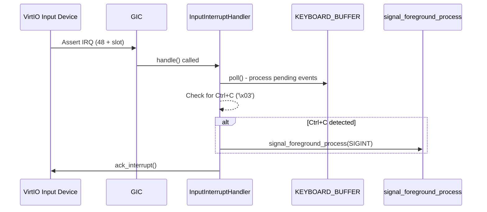

# Phase 3: Fix Design

**Status**: ✅ Complete (Reviewed by TEAM_241)

## Root Cause Summary

`input::poll()` is only called from `read_stdin()`. When foreground process is blocked (not reading stdin), Ctrl+C is never detected.

## Fix Strategy

Implement VirtIO input interrupt handling to detect keyboard input asynchronously.

### High-Level Approach



### Implementation Steps

| Step | Description | Files Modified |
|------|-------------|----------------|
| 1 | Track MMIO slot index during input device discovery | `kernel/src/virtio.rs` |
| 2 | Add VirtioInput IRQ variant and compute IRQ from slot | `crates/hal/src/gic.rs`, `kernel/src/input.rs` |
| 3 | Create InputInterruptHandler with Ctrl+C detection | `kernel/src/input.rs` |
| 4 | Register handler and enable IRQ during init | `kernel/src/input.rs` |

### Design Decisions

**D1: IRQ Number Computation**

QEMU `virt` machine assigns VirtIO MMIO IRQs sequentially:
- Base IRQ for VirtIO MMIO = `48` (SPI 16)
- Formula: `IRQ = 48 + slot_index`

We pass the slot index to `input::init()` so it can compute its IRQ.

**D2: Immediate Ctrl+C Signaling**

Instead of buffering Ctrl+C like other characters, we:
1. Detect Ctrl+C during `poll()` (already happens)
2. **Additionally** call `signal_foreground_process(SIGINT)` immediately in the ISR

This ensures the signal is sent even if no one is reading the buffer.

**D3: Keep Polling as Fallback**

Existing `poll()` behavior remains unchanged. The interrupt handler simply calls `poll()` when triggered, so both interrupt-driven and poll-driven paths work.

---

## Reversal Strategy

If the fix causes issues:
1. Remove interrupt handler registration from `input::init()`
2. Remove `VirtioInput` from `IrqId` enum
3. Revert slot tracking in `virtio.rs`
4. Kernel reverts to polling-only approach (current behavior)

---

## Test Strategy

### Automated Tests

1. **Build Test**: `cargo xtask build all` must succeed
2. **Existing Tests**: All userspace tests must still pass

### Manual Verification

```bash
# In QEMU:
signal_test
# Press Ctrl+C when "Waiting for signal in pause()..." appears
# Expected: Process should receive SIGINT and terminate
```

**Detailed Steps**:
1. Run `./run-term.sh` to start QEMU
2. Wait for shell prompt
3. Type `signal_test` and press Enter
4. Wait for "Waiting for signal in pause()..."
5. Press Ctrl+C
6. **Expected**: See "Signal handler called with signal 2" and process terminates
7. **Failure**: No response to Ctrl+C (process stays blocked)

---

## Impact Analysis

| Aspect | Impact |
|--------|--------|
| API Changes | `input::init()` now takes slot index parameter |
| New Types | `IrqId::VirtioInput` variant added |
| Performance | Improved - interrupt-driven is more efficient than polling |
| Risk | Low - additive change, fallback to polling still works |
